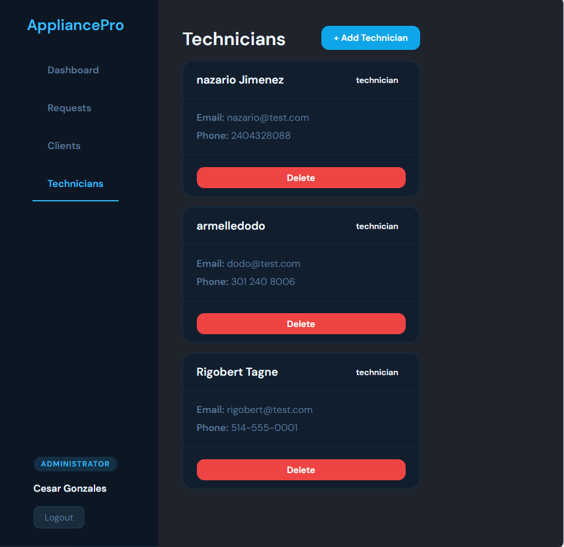
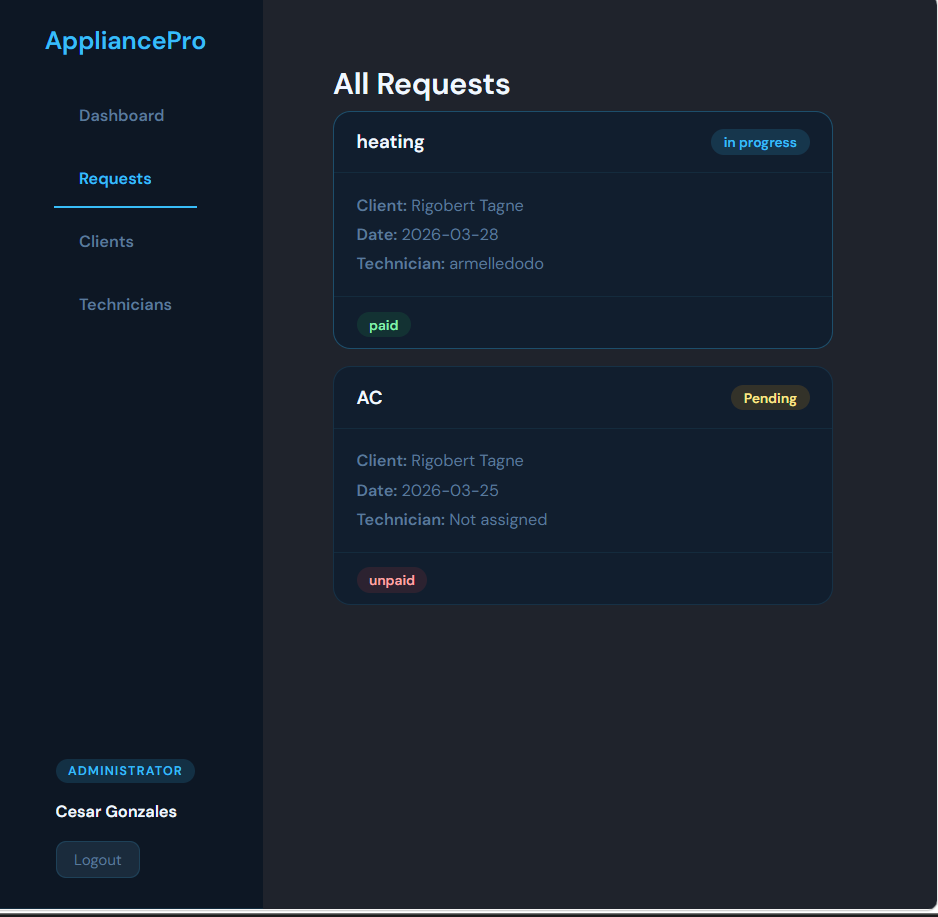

 AppliancePro 

A full-stack service request management application for appliance repair and maintenance. Clients can submit service requests, technicians manage their assigned jobs, and administrators oversee the entire operation.

## 🚀 Live Demo
Coming soon

 Screenshots




 Built With

**Frontend**
- React.js
- React Router DOM
- Context API
- Axios
- CSS3

**Backend**
- Node.js
- Express.js
- MongoDB
- Mongoose
- JWT Authentication
- Bcrypt.js

Features

**Client**
- Register and login securely
- Submit service requests (type, urgency, date, address, description)
- Track the status of all requests in real time
- View payment status

**Technician**
- View all assigned requests
- Update request status (pending, in progress, completed, cancelled)
- Add notes to requests
- View client contact information

**Administrator**
- Dashboard with statistics (total requests, pending, in progress, completed, unpaid)
- View and manage all service requests
- Assign technicians to requests
- Update request status and payment
- Manage clients and technicians (view, delete)

Getting Started

 Prerequisites
- Node.js
- MongoDB Atlas account
- npm

 Installation

1. Clone the repository
\```bash
git clone https://github.com/YOUR_USERNAME/appliancepro.git
cd appliancepro
\```

2. Install backend dependencies


npm install


3. Create a `.env` file in the backend folder

PORT=5000
MONGO_URI=mongodb://localhost:27017/appliancepro
JWT_SECRET_KEY=appliancepro_secret_key_2026


4. Start the backend

npx nodemon server.js


5. Install frontend dependencies

npm install


6. Start the frontend

npm start


The app will run on `http://localhost:3000`

📁 Project Structure

appliancepro/
├── backend/
│   ├── models/
│   │   ├── User.js
│   │   └── Request.js
│   ├── routes/
│   │   ├── auth.js
│   │   ├── requests.js
│   │   └── users.js
│   ├── middleware/
│   │   └── auth.js
│   └── server.js
└── frontend/
    ├── src/
    │   ├── components/
    │   │   └── ProtectedRoute.jsx
    │   ├── context/
    │   │   └── MyContext.jsx
    │   ├── pages/
    │   │   ├── Login.jsx
    │   │   ├── Register.jsx
    │   │   ├── clients/
    │   │   │   ├── ClientDashboard.jsx
    │   │   │   └── NewRequest.jsx
    │   │   ├── technicians/
    │   │   │   └── TechnicianDashboard.jsx
    │   │   └── administrator/
    │   │       ├── AdminDashboard.jsx
    │   │       ├── AdminRequests.jsx
    │   │       ├── AdminClients.jsx
    │   │       └── AdminTechnicians.jsx
    │   └── services/
    │       └── api.js
    └── public/


## 🔐 Roles & Access

Role and Access 
Client  Submit and track own requests.
Technician  View assigned requests, update status, add notes.
Administrator Full access to all requests, users, and statistics.

 Author
Armelle
- GitHub: [Dodie_code](https://github.com/dodie-code)

- LinkedIn:
https://www.linkedin.com/in/armelle-ngainkam-nkuissi